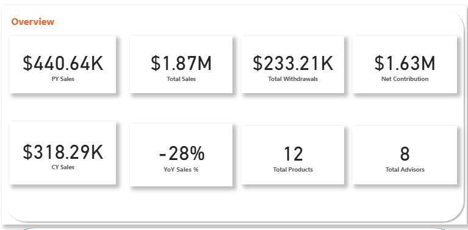
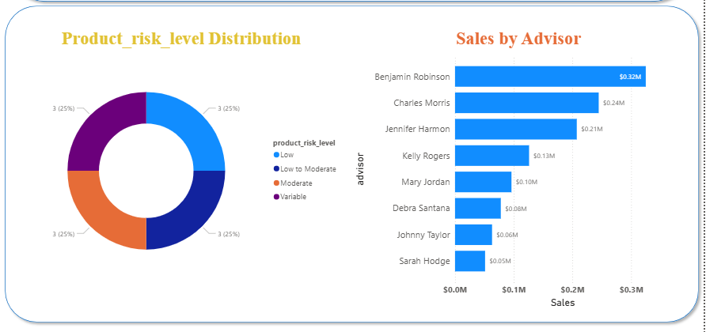
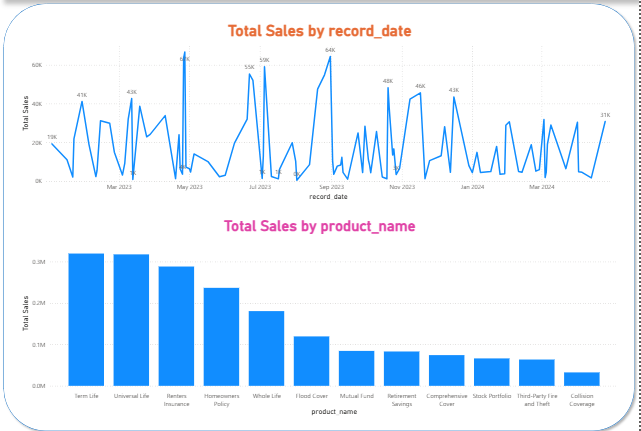

# CityLife 360 – Power BI Dashboard

📊 End-to-End Business Intelligence Project for Wealth & Insurance

This repository contains a Power BI report (CityLife360_Project.pbix) and a sample data file (CityLifeData.xlsx) used to build an executive-facing 360° dashboard for CityLife's VP of Sales. The report demonstrates time-intelligence DAX, dynamic KPIs, and interactive visual insights.

---

## Table of contents
- Project overview
- Getting started
- Data & privacy
- Key pages & screenshots
- DAX measures (examples & recommendations)
- Recommended best practices
- Project structure
- Contributing
- License
- Contact

---

## Project overview
Objectives:
- Build an interactive multi-page Power BI dashboard
- Track Sales, Withdrawals, Net Contribution and YoY performance
- Analyze across products, advisors, and risk levels
- Implement DAX time intelligence (CY, PY, YoY%)
- Provide a clean, executive-ready UI

This repo contains the PBIX and a sample Excel data file used to build the visuals. The PBIX includes a dedicated Date (Calendar) table which is used for all time-intelligence measures.

---

## Getting started

Prerequisites:
- Power BI Desktop (recommended: the latest stable release; tested with Power BI Desktop version [please note your tested version here])
- Windows or supported OS for Power BI
- (Optional) Git LFS if you plan to version-control large .pbix files

Open the report:
1. Download `CityLife360_Project.pbix` from the repository (or Releases).
2. Place `CityLifeData.xlsx` in the same directory as the PBIX or re-point the data source from Power BI Desktop: Home → Transform data → Data source settings → Change source.
3. In Power BI Desktop, confirm the dedicated Date table is present and is marked as the model date table: Model → select the Date table → Modeling → Mark as date table.
4. Refresh data: Home → Refresh (ensure data source path and credentials are configured).

Notes:
- If you plan to store PBIX in Git, use Git LFS or Releases to avoid bloating git history.
- If CityLifeData.xlsx contains production or sensitive data, remove it from the public repo and replace with anonymized sample data.

---

## Data & privacy
- `CityLifeData.xlsx` is included as a sample dataset. Ensure any production or sensitive data is anonymized before committing.
- Typical tables used (example schema):
  - Sales (record_date, advisor_id, product_id, amount, withdrawal_amount, risk_level, ...)
  - Products (product_id, product_name, category, risk_level)
  - Advisors (advisor_id, advisor_name, team, region)
  - Date (Date, Year, Month, Day, FiscalYear, IsBusinessDay) — dedicated Calendar table (present in PBIX)

If this repository will include real client data, remove it and provide a sample dataset instead.

---

## Key pages & screenshots

Executive Summary (KPIs, trend):


Sales by Advisor:


Sales by Product:


(If images do not render, ensure `images/` folder exists and file names match.)

---

## DAX measures (examples & recommendations)

Important: The PBIX uses a dedicated Date/Calendar table named `Date` and it should be marked as the model date table. Time intelligence measures below assume that.

Core measures (illustrative):

- Total Sales
```
Total Sales = SUM('Sales'[amount])
```

- Total Withdrawals
```
Total Withdrawals = SUM('Sales'[withdrawal_amount])
```

- Net Contribution
```
Net Contribution = [Total Sales] - [Total Withdrawals]
```

- Current Year Sales (CY) — recommended approach with Date table:
```
CY Sales =
CALCULATE(
  [Total Sales],
  YEAR('Date'[Date]) = YEAR(MAX('Date'[Date]))
)
```

- Prior Year Sales (PY) — preferred using SAMEPERIODLASTYEAR:
```
PY Sales =
CALCULATE(
  [Total Sales],
  SAMEPERIODLASTYEAR('Date'[Date])
)
```

- YoY Sales %
```
YoY Sales % =
DIVIDE( [CY Sales] - [PY Sales], [PY Sales], 0 )
```

- Example using VARs for readability:
```
YoY Sales % (clean) =
VAR _CY = [CY Sales]
VAR _PY = [PY Sales]
RETURN
DIVIDE(_CY - _PY, _PY, 0)
```

Notes:
- SAMEPERIODLASTYEAR and DATEADD require a continuous Date table with no gaps.
- Use DIVIDE(..., 0) to avoid divide-by-zero errors.
- Consider using USERELATIONSHIP where multiple date columns exist for context-specific measures.

CONST / Current Date table:
- If you prefer a single-row table with a snapshot date:
```
CONST =
DATATABLE(
  "CurrentDate", DATETIME,
  { { DATE(2025, 12, 31) } }
)
```
Then refer to it in measures when needed (example: compare to snapshot date). Document how the CONST table is updated.

---

## Recommended best practices
- Create and mark a Date/Calendar table as the model date table (the PBIX already has this).
- Use DAX VARs for clarity and performance.
- Avoid storing production-sensitive Excel files in a public repo. Prefer sample/anonymized datasets.
- Keep PBIX files under Releases or use Git LFS.
- Document Power Query transformations and complex modelling decisions (either in this README or separate docs).
- Use descriptive measure names and a consistent naming convention.

---

## Project structure
CityLife360-PowerBI-Dashboard/
├─ CityLife360_Project.pbix
├─ CityLifeData.xlsx
├─ README.md
├─ LICENSE
└─ images/
   ├─ overview.png
   ├─ sales_by_advisor.png
   └─ sales_by_product.png

---

## Contributing
Please read CONTRIBUTING.md (in this repo) for the contribution workflow. In brief:
1. Fork the repository.
2. Create a feature branch (git checkout -b feature/your-feature).
3. Commit changes and push to your fork.
4. Open a Pull Request describing the change, include screenshots for UI changes, and link related issues.

(If you want stricter rules, add a CONTRIBUTING.md file with templates and branch rules.)

---

## License
This project is licensed under the MIT License — see the [LICENSE](LICENSE) file for details.

---

## Contact
Developer: Vikas Giri  
GitHub: https://github.com/Vikas-Giri  
LinkedIn: https://linkedin.com/in/vikasgiri

---

If you want, I can:
- open a PR with these files,
- commit directly to a branch you name,
- or update an existing branch. Tell me which you'd prefer and which license year or author name to use if different from what's included.
